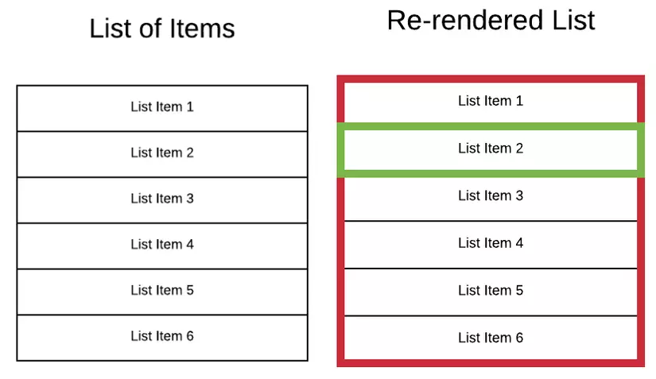

# Rendering element

## Render 1 element đến DOM

Quá trình render diễn ra như thế nào trong React?
- Khi bạn khởi chạy 1 app react thì react sẽ tiến hành Render các component. `file main.tsx`
- React gọi hàm root.render() để thực hiện render và trả lại kết quả vào ReactDOM.
- ReactDOM có nhiệm vụ thực hiện nạp kết quả vào thẻ `

` có id là root ở file `public\index.html`
- Và cuối cùng là kết quả được hiển thị ra màn hình. Bạn view code lên thì thấy `

` trống rỗng không chứa gì cả nhưng lại thấy kết quả hiển thị ra màn hình trình duyệt. ==> như vậy sẽ rất khó để SEO web
- root.render() chỉ chạy 1 lần, chính vì lí do này mà khi có nhiều element thì cần đặt chúng trong 1 thẻ cha. `<></>`

## React update 1 element đã được render như thế nào?

- React element là bất biến k thay đổi, bạn k thể thay đổi các element con , các thuộc tính của nó. Bạn có thể hiểu nó như 1 `snapshot` của Virtual DOM ( có thể hiểu là bản ghi trạng thái ngay lúc đó)
- Cách duy nhất React cập nhật giao diện người dùng (UI) là tạo ra 1 `snapshot`mới và đẩy chúng tới `root.render()` để render hiển thị ra màn hình.

## React chỉ update những gì cần thiết

- Trong React chỉ update thay đổi cần thiết hay thay đổi ở đâu thì chỉ cập nhật chổ đó rồi Render lại (UI)

